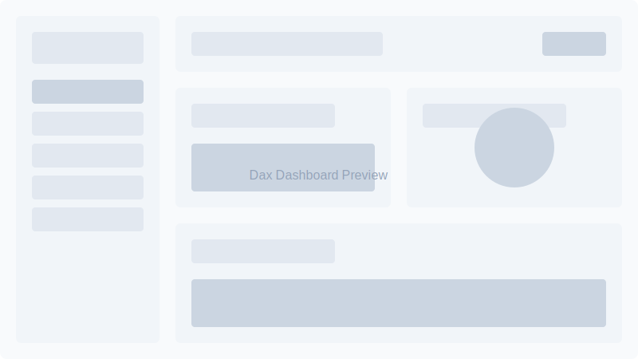

# Dax - SaaS Dashboard for Startups

Dax is a modern, customizable dashboard designed to help startups track and visualize their key metrics, manage projects, and streamline their workflows.



## Features

- 📊 Interactive analytics widgets
- 📝 Task management
- 🗺️ Project roadmap visualization
- 💡 Idea collection and management
- 📣 Feedback management
- 📄 Documentation system

## Technical Highlights

- **Modern Stack**: Built with Next.js 14 (App Router), TypeScript, and Tailwind CSS
- **Type-Safe Development**: Leveraging TypeScript's type system with generics, discriminated unions, and more
- **Component Architecture**: Modular, reusable components following SOLID principles
- **Performance Optimized**: Efficient rendering with React Server Components and client-side components where appropriate
- **Responsive Design**: Mobile-first approach ensuring great UX across all devices
- **Accessibility**: WCAG 2.1 AA compliant with full keyboard navigation and screen reader support

## Technical Challenges Solved

- **Dynamic Dashboard Layout**: Implemented a flexible grid layout system allowing for widget customization
- **Real-time Data Visualization**: Created optimized charts with throttled updates to minimize re-renders
- **Type-Safe API Layer**: Built a strongly-typed API client with automatic error handling and retry mechanisms
- **Authentication Flow**: Secure, multi-provider auth with role-based access control

## Getting Started

### Prerequisites

- Node.js 18.x or later
- npm or yarn or pnpm

### Installation

1. Clone the repository:
```bash
git clone https://github.com/yourusername/dax.git
cd dax
```

2. Install dependencies:
```bash
npm install
# or
yarn install
# or
pnpm install
```

3. Set up environment variables:
```bash
cp .env.example .env.local
```
Edit the `.env.local` file with your configuration values.

4. Run the development server:
```bash
npm run dev
# or
yarn dev
# or
pnpm dev
```

5. Open [http://localhost:3000](http://localhost:3000) with your browser to see the application.

## Project Structure

```
/app                # Next.js app directory
  /dashboard        # Dashboard pages
  /api              # API endpoints
  /(auth)           # Authentication flows
  ...               # Other app routes
/components         # Reusable UI components
/hooks              # Custom React hooks
/lib                # Utility libraries
/models             # Database models
/public             # Static assets
/types              # TypeScript type definitions
```

## Technologies

- [Next.js](https://nextjs.org/) - React framework
- [TypeScript](https://www.typescriptlang.org/) - Type safety
- [Tailwind CSS](https://tailwindcss.com/) - Styling
- [MongoDB](https://www.mongodb.com/) - Database
- [NextAuth.js](https://next-auth.js.org/) - Authentication
- [Radix UI](https://www.radix-ui.com/) - UI primitives
- [Jest](https://jestjs.io/) - Testing

## Roadmap

### Current Focus (Q3 2023)
- ✅ Core dashboard UI
- ✅ Project management features
- ✅ Basic analytics

### Coming Soon (Q4 2023)
- 🔒 Authentication system (OAuth2, JWT, and email/password)
- 🔌 Integration with third-party services (GitHub, Slack, etc.)
- 📱 Mobile responsiveness improvements

### Future Plans (2024)
- 📊 Advanced analytics with customizable widgets (KPI tracking, funnel analysis, cohort analysis)
- 🔄 Real-time collaboration
- 🌐 Multi-language support
- 🔐 Role-based access control
- 🤖 AI-assisted insights

## Contributing

We welcome contributions! Please see our [Contributing Guide](CONTRIBUTING.md) for details.

## Security

We take security seriously. If you discover a security vulnerability, please send an email to security@example.com instead of opening an issue.

## License

This project is licensed under the MIT License - see the [LICENSE](LICENSE) file for details.

## Support

For support, email support@example.com or join our [community forum](https://community.example.com).
